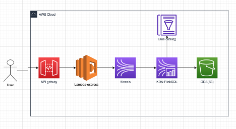
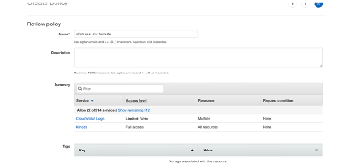
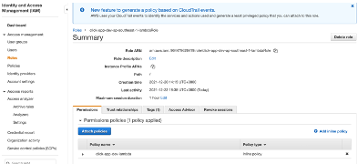
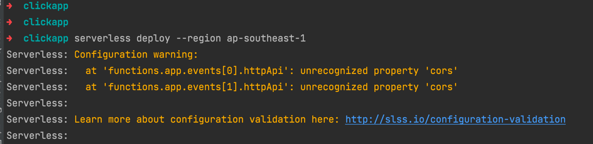
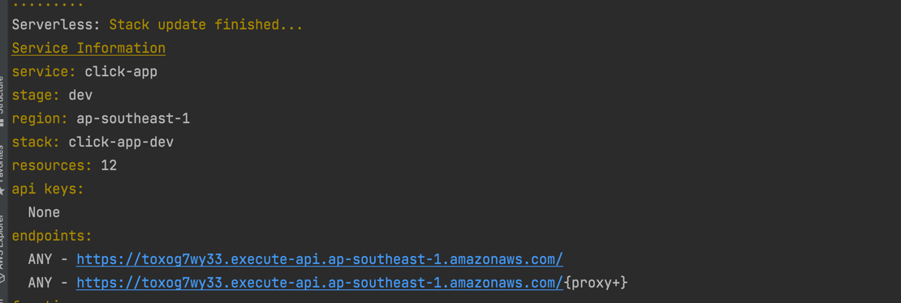

架构说明：



1.	Api getway 作为Http 入口
2.	Lambda 简单处理后，将消息放入kinesis
3.	KDA拿到消息后，简单处理后放入s3


部署步骤：
1. 创建 Lambda Role

需要具备kinesis，cloudwatch权限

先创建Policy  ‘click-app-dev-lambda’:


```{
    "Version": "2012-10-17",
    "Statement": [
        {
            "Sid": "VisualEditor0",
            "Effect": "Allow",
            "Action": "kinesis:*",
            "Resource": "*"
        },
        {
            "Sid": "VisualEditor1",
            "Effect": "Allow",
            "Action": [
                "logs:CreateLogStream",
                "logs:CreateLogGroup"
            ],
            "Resource": "arn:aws:logs:ap-southeast-1:964479626419:log-group:/aws/lambda/click-app-dev*:*"
        },
        {
            "Sid": "VisualEditor2",
            "Effect": "Allow",
            "Action": "logs:PutLogEvents",
            "Resource": "arn:aws:logs:ap-southeast-1:964479626419:log-group:/aws/lambda/click-app-dev*:*:*"
        }
    ]
}
```
创建创建Role， Rule name is ‘click-app-dev-ap-southeast-1-lambdaRole’

下载本工程，并部署




1. serverless deploy --region ap-southeast-1 


2. 部署完成后，找到endpoint。


3. 测试API curl -G https://toxog7wy33.execute-api.ap-southeast-1.amazonaws.com/api/v1/userpage
```
➜  ~ curl -G  https://toxog7wy33.execute-api.ap-southeast-1.amazonaws.com/api/v1/userpage
{"result":"send successful","version":"1"}%
```


